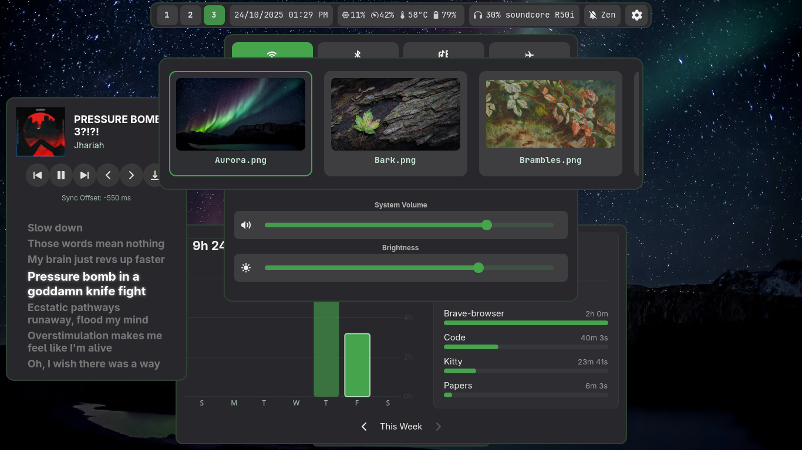

# Aurora-Shell


###### *Song: Pressure Bomn?!?! - Jhariah*
---

### An arch user's descent into AI exploitation... And apparently Desktop Shell Development.

A fully automated and cohesive desktop experience built on Hyprland, made possible using C/GTK4 - And AI exploitation.

---

### Key Features

*   **Fully Config-Driven:** Every component—from the bar to pop-up widgets—is defined in a central `config.json`. Add, remove, or reconfigure widgets without touching a line of code.
*   **Dynamic Theming:** Integrates with `wallust` to generate color palettes directly from your wallpaper. A single command updates the theme across all widgets and supported system applications.
*   **Modular Topbar:** A feature-rich bar with support for pluggable modules, including workspaces, a system tray, pop-over menus, and clickable elements.
*   **Powerful Widgets:**
    *   **Control Center:** Manage Wi-Fi, Bluetooth, audio, brightness, and system metrics.
    *   **Event-Aware Calendar:** A full calendar with support for creating, reading, and deleting events.
    *   **MPRIS Media Player:** Displays media info and perfectly **synced lyrics** for any MPRIS-compatible player.
    *   **Utility Suite:** Includes a fast App Launcher, a system Uptime badge, a hotkey Cheatsheet, and a real-time resource monitor (Insight).

---

### How It Works

Aurora Shell runs as a single, persistent background process. It reads your `config.json` and loads each defined item:
- **Widgets (`.so` plugins):** The visual components of the shell.
- **Daemons:** Background services required by certain widgets.
- **Commands:** Aliases to launch external scripts or applications.

You interact with the running shell using the main executable with the `--toggle` flag. This design makes it trivial to bind widgets to hotkeys in any window manager.

### Integrating with Hyprland

Add the following to your `~/.config/hyprland/hyprland.conf` to integrate the shell.

```ini
# ~/.config/hyprland/hyprland.conf

# --- Aurora Shell Integration ---

# Automatically start the Aurora Shell host process on login
exec-once = aurora-shell

# Keybindings to toggle individual widgets
# (Change $mainMod and keys to your preference)

# Launcher ($mainMod + D)
bind = $mainMod, D, exec, aurora-shell --toggle launcher

# Control Center ($mainMod + C)
bind = $mainMod, C, exec, aurora-shell --toggle control-center

# Calendar ($mainMod + A)
bind = $mainMod, A, exec, aurora-shell --toggle calendar

# Cheatsheet ($mainMod + K)
bind = $mainMod, K, exec, aurora-shell --toggle cheatsheet

# MPRIS Media Player ($mainMod + M)
bind = $mainMod, M, exec, aurora-shell --toggle mpris-player

# Wallpaper Changer / Themer ($mainMod + T)
bind = $mainMod, T, exec, aurora-shell --toggle cachy-selector

# Insight Resource Monitor ($mainMod + I)
bind = $mainMod, I, exec, aurora-shell --toggle insight
```

## Configuration

Aurora Shell is configured entirely within `~/.config/aurora-shell/`. This directory is created for you upon the first run.

-   **`config.json`:** The brain of the shell. Defines which components to load, their properties, and their layout.
-   **`templates/`:** Contains the CSS stylesheets for all widgets.

### Main Configuration: `config.json`

This file is a JSON array where each object defines a component. A component can have one of several `type` values: `widget`, `daemon`, `command`, or `themer-config`.

#### Component Types

1.  **`"type": "widget"`** (Default)
    This is a visual, interactive component loaded from a `.so` plugin file. It uses a common set of properties for positioning and behavior.

    | Property           | Type    | Description                                                                     |
    | :----------------- | :------ | :------------------------------------------------------------------------------ |
    | `name`             | String  | A unique name used for toggling (e.g., "topbar", "launcher").                   |
    | `plugin`           | String  | Absolute path to the widget's compiled `.so` plugin file.                       |
    | `stylesheet`       | String  | The name of the CSS file in `~/.config/aurora-shell/templates/<widget>/`.         |
    | `layer`            | String  | Wayland layer: `background`, `bottom`, `top`, or `overlay`.                     |
    | `anchor`           | String  | Position on screen: `top`, `bottom`, `left`, `right`, `center` or combinations. |
    | `visible_on_start` | Boolean | If `true`, the widget is visible when the shell starts.                         |
    | `interactive`      | Boolean | If `true`, the widget can receive keyboard focus.                               |
    | `exclusive`        | Boolean | If `true`, reserves space so fullscreen windows don't cover it (for bars).      |
    | `margin`           | Object  | Sets space around the widget. Example: `{ "top": 5, "left": 10 }`.              |
    | `size`             | Object  | Sets a fixed size. Example: `{ "width": 500, "height": 300 }`.                  |
    | `close`            | Array   | An array of other widget `name`s to close when this one is opened.              |
    | `config`           | Object  | A nested object for widget-specific settings (e.g., topbar modules).            |

    *Example: The Calendar widget, which closes the Control Center when opened.*
    ```json
    {
      "name": "calendar",
      "plugin": "/usr/local/lib/aurora-shell/widgets/calendar.so",
      "stylesheet": "calendar.css",
      "anchor": "top-center",
      "layer": "top",
      "margin": { "top": 5 },
      "close": [ "control-center" ]
    }
    ```

2.  **`"type": "command"`**
    This creates a named alias for an external command or script. Running `aurora-shell --toggle <name>` will execute the specified `command`.

    *Example: The `cachy-selector` entry, which runs a shell script.*
    ```json
    {
      "name": "cachy-selector",
      "type": "command",
      "command": "toggle-selector.sh"
    }
    ```
3.  **`"type": "daemon"`**
    This defines a background process that the shell should ensure is running. The shell will check if the process exists and start it if it doesn't.

    *Example: The daemon for the Insight resource monitor.*
    ```json
    {
      "type": "daemon",
      "name": "aurora-insight-daemon",
      "command": "aurora-insight-daemon"
    }
    ```
4.  **`"type": "themer-config"`**
    A special, non-functional entry that provides configuration values for external scripts, such as the wallpaper themer.

    *Example: Telling `wallpaper.sh` where to find wallpapers.*
    ```json
    {
        "type": "themer-config",
        "name": "global-themer-settings",
        "wallpaper_dir": "~/Pictures/Wallpapers"
    }
    ```

### Styling and Theming

All visual styling is handled by CSS located in `~/.config/aurora-shell/templates/`. The theming system uses a template-based approach:

1.  **Template Files (`*-template.css`):** These are the base stylesheets containing color placeholders like `{{background}}` and `{{accent}}`.
2.  **Themer Script (`wallpaper.sh`):** When you change your wallpaper using the selector, this script reads the template, replaces the placeholders with colors generated from the new wallpaper, and saves the result.
3.  **Active Files (`*.css`):** This is the final, generated CSS file that is loaded by the widget (as specified by the `stylesheet` property in `config.json`).

This workflow allows you to customize the structure and layout in the `*-template.css` files while letting the themer automate the color scheme.

## Dependencies

### Core Build Tools
`meson`, `ninja`, and a C compiler (`gcc` or `clang`).

### Project Libraries
| Dependency Name           | Arch Linux          | Debian / Ubuntu          | Fedora                     |
| :------------------------ | :------------------ | :----------------------- | :------------------------- |
| `gtk4`                    | `gtk4`              | `libgtk-4-dev`           | `gtk4-devel`               |
| `libadwaita-1`            | `libadwaita`        | `libadwaita-1-dev`       | `libadwaita-devel`         |
| `gtk4-layer-shell-0`      | `gtk-layer-shell`   | `libgtk-layer-shell-0-dev` | `gtk-layer-shell-devel`    |
| `json-glib-1.0`           | `json-glib`         | `libjson-glib-dev`       | `json-glib-devel`          |
| `libsoup-3.0`             | `libsoup3`          | `libsoup-3.0-dev`        | `libsoup3-devel`           |

### Runtime Dependencies
*   **Theming:** `swww`, `wallust`, `jq`.
*   **MPRIS Player:** `playerctl`.
*   **Control Center:** `network-manager`, `bluez` (`bluez-tools`), `pipewire-pulse` (or `pulseaudio`).

---

### Install Commands

**On Arch Linux:**
```bash
sudo pacman -S meson ninja gcc gtk4 libadwaita gtk-layer-shell json-glib libsoup3 \
               playerctl networkmanager bluez bluez-utils pipewire-pulse swww wallust jq
```

**On Debian / Ubuntu:**
```bash
sudo apt install meson ninja build-essential libgtk-4-dev libadwaita-1-dev \
                 libgtk-layer-shell-0-dev libjson-glib-dev libsoup-3.0-dev playerctl \
                 network-manager bluez pipewire-audio-client-libraries swww wallust jq
```

**On Fedora:**
```bash
sudo dnf install meson ninja gcc gtk4-devel libadwaita-devel gtk-layer-shell-devel \
                 json-glib-devel libsoup3-devel playerctl NetworkManager bluez \
                 pipewire-pulseaudio swww wallust jq
```

## Installation

1.  **Clone the repository and navigate into it:**
    ```bash
    git clone https://github.com/Spn4x/Aurora-Shell.git
    cd aurora-shell
    ```

2.  **Set up the build directory using Meson:**
    ```bash
    meson setup build
    ```

3.  **Compile the source code:**
    ```bash
    ninja -C build
    ```

4.  **Install the application system-wide:**
    ```bash
    sudo meson install -C build
    ```

## Uninstallation

To completely remove Aurora Shell from your system, follow these steps.

1.  **Navigate to the build directory** within the project folder:
    ```bash
    cd /path/to/aurora-shell/build
    ```

2.  **Run the Ninja uninstall script:**
    This removes the binaries and other files managed by the installer.
    ```bash
    sudo ninja uninstall
    ```

3.  **Manually remove the shared data directory:**
    ⚠️ This command permanently deletes the directory and its contents.
    ```bash
    sudo rm -rf /usr/local/share/aurora-shell
    ```

---

## License

Distributed under the terms of the GNU General Public License v3.0. See the 'LICENSE' file for more information.
