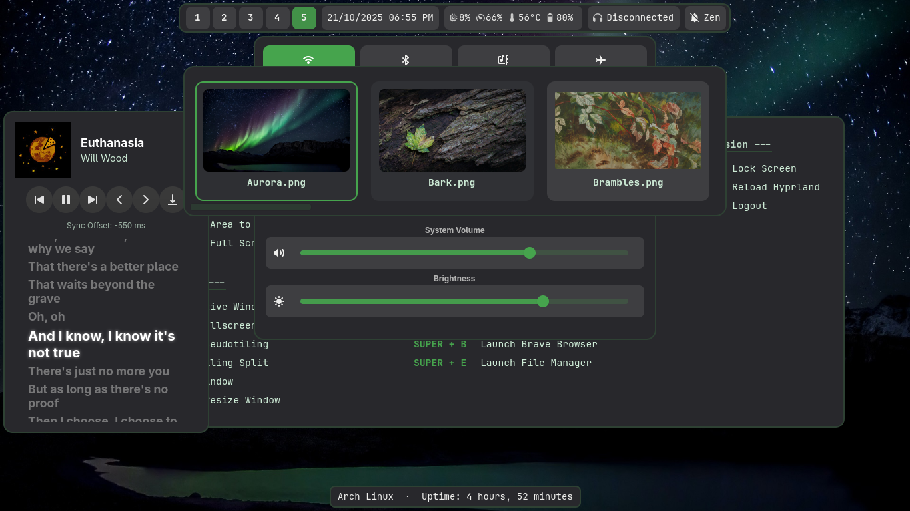

# Aurora-Shell


###### *Song: Euthanasia - Will Wood*
---

### An arch user's descent into AI exploitation... And apparently Desktop Shell Development.

A fully automated and cohesive desktop experience built on Hyprland, made possible using C/GTK4 - And AI exploitation.

---

### Key Features

* **Dynamic Theming:** Leveraging Wallust, a set of color palletes are generated from the wallpaper and applied to the set of default widgets the shell provides.
*   **Control Center:** Manages Wi-Fi, Bluetooth, audio sinks, brightness, and volume.
*   **Hyper-Calendar:** A full calendar with CRUD (Create, Read, Update, Delete) functionality for managing events and schedules.
*   **Side-MPRIS-Player:** A media player widget that displays metadata and features perfectly **synced lyrics** for music playing in any MPRIS-compatible player (including browsers).
* **App-Launcher:** Launches apps and does math I guess.

---

### Usage

All widgets are controlled through the main `aurora-shell` executable using the `--toggle` flag. This design makes it easy to integrate with any workflow or window manager.

### Integrating with Hyprland

The most common way to use Aurora Shell is by adding entries to your `hyprland.conf`.

1.  **Launching Widgets on Startup:**
    Add an `exec-once` rule for any widget you want to be visible when you log in, like the topbar.

2.  **Creating Keybindings:**
    Use `bind` rules to assign a keyboard shortcut to toggle each widget.

Here is a sample configuration to add to your `~/.config/hyprland/hyprland.conf`:

```ini
# ~/.config/hyprland/hyprland.conf

# --- Aurora Shell Integration ---

# Automatically start the topbar when Hyprland loads
exec-once = aurora-shell --toggle topbar

# Keybindings to toggle individual widgets
# (Change $mainMod and keys to your preference)

# Launcher ($mainMod + D)
bind = $mainMod, D, exec, aurora-shell --toggle launcher

# Control Center ($mainMod + C)
bind = $mainMod, C, exec, aurora-shell --toggle control-center

# Calendar ($mainMod + A)
bind = $mainMod, A, exec, aurora-shell --toggle calendar

# Cheatsheet ($mainMod + K)
bind = $mainMod, K, exec, aurora-shell --toggle cheatsheet

# MPRIS Media Player ($mainMod + M)
bind = $mainMod, M, exec, aurora-shell --toggle mpris-player

# Themer / Wallpaper Changer
bind = $mainMod, T, exec, aurora-shell --toggle themer

# Uptime / System Info
bind = $mainMod, U, exec, aurora-shell --toggle uptime
```

## Configuration

Aurora Shell is configured entirely within the `~/.config/aurora-shell/` directory. This directory is created for you upon first run, but you can also create it manually.

The configuration is split into two main parts:
*   `config.json`: Defines what widgets to load, their behavior, and their position.
*   `templates/`: A directory containing CSS files for styling each widget.

### Main Configuration: `config.json`

This file is the brain of your setup. It is a JSON array where each object in the array defines a single widget instance. This allows you to define and customize every component on your screen.

#### Common Widget Properties

Most widgets share a common set of configuration properties:

| Property             | Type          | Description                                                                                              |
| :------------------- | :------------ | :------------------------------------------------------------------------------------------------------- |
| `name`               | String        | A unique name for the widget (e.g., "topbar", "launcher").                                               |
| `plugin`             | String        | The absolute path to the widget's compiled `.so` plugin file.                                            |
| `stylesheet`         | String        | The name of the CSS file within `~/.config/aurora-shell/templates/<widget>/` to apply.                     |
| `layer`              | String        | The Wayland layer: `background`, `bottom`, `top`, or `overlay`.                                          |
| `anchor`             | String        | Where to position the widget on screen (e.g., `top`, `bottom`, `left`, `right`, `center`). Supports combinations like `top-left`. |
| `visible_on_start`   | Boolean       | If `true`, the widget will be visible when `aurora-shell` starts.                                        |
| `interactive`        | Boolean       | If `true`, the widget can receive keyboard focus. Set to `false` for informational widgets.            |
| `margins`            | Object        | Sets space around the widget. Example: `{ "top": 5, "left": 10 }`.                                       |
| `size`               | Object        | Sets a fixed size for the widget. Example: `{ "width": 500, "height": 300 }`.                             |
| `animation`          | Object        | (Optional) Defines an entry animation for the widget.                                                    |
| `config`             | Object        | (Optional) A nested object for widget-specific settings (see Topbar example below).                      |

#### Example Widget Definition (`topbar`)

This example from the default configuration shows how these properties work together to create a feature-rich top bar.

```json
{
  "name": "topbar",
  "plugin": "/usr/local/lib/aurora-shell/widgets/topbar.so",
  "stylesheet": "topbar.css",
  "layer": "top",
  "anchor": "top",
  "exclusive": true, // This reserves space, so fullscreen windows don't cover it
  "visible_on_start": true,
  "interactive": true,
  "margins": { "top": 5, "left": 5, "right": 5 },
  // Widget-specific configuration
  "config": {
    "modules": {
      "left": [ { "name": "workspaces" } ],
      "center": [ { "name": "clock", "on-click": "aurora-shell --toggle calendar" } ],
      "right": [
        { "name": "sysinfo", "on-click": "aurora-shell --toggle control-center" },
        { "name": "audio" },
        { "name": "zen", "on-click-right": "swaync-client --toggle-panel" }
      ]
    }
  }
}
```

### Styling and Theming

All visual styling is handled by CSS. The `~/.config/aurora-shell/templates/` directory contains a subdirectory for each widget's styles.

#### The Template System

The theming workflow is designed to be dynamic:

1.  **Template Files (`*-template.css`):** These are the base stylesheets. They may contain placeholder variables for colors.
2.  **Themer Script:** When you run the `themer` widget (e.g., via `wallpaper.sh`), it reads a template file, replaces the variables with colors generated from your wallpaper, and saves the result as a new file.
3.  **Active Files (`*.css`):** This is the final, generated CSS file that is actually loaded by the widget, as specified in your `config.json`.

This means you can edit the `*-template.css` files to change the fundamental structure and style, and then run the themer to apply your color scheme. To apply custom, static styles, you can simply edit the final `.css` files directly.

### Command Reference

Here is a complete list of the default widget toggle commands:

| Widget | Command |
| :--- | :--- |
| **Topbar** | `aurora-shell --toggle topbar` |
| **Launcher** | `aurora-shell --toggle launcher` |
| **Control Center** | `aurora-shell --toggle control-center` |
| **Calendar** | `aurora-shell --toggle calendar` |
| **Cheatsheet** | `aurora-shell --toggle cheatsheet` |
| **MPRIS Player** | `aurora-shell --toggle mpris-player` |
| **Themer** | `aurora-shell --toggle themer` |
| **Uptime** | `aurora-shell --toggle uptime` |

## Dependencies

Before building, you must install the necessary development packages and libraries.

### Core Build Tools

You will need `meson`, `ninja`, and a C compiler like `gcc`.

### Project Libraries

Aurora Shell and its widgets rely on several libraries. The table below lists the required Meson dependency names and the corresponding package names for popular distributions.

| Dependency Name           | Arch Linux          | Debian / Ubuntu          | Fedora                     |
| :------------------------ | :------------------ | :----------------------- | :------------------------- |
| `gtk4`                    | `gtk4`              | `libgtk-4-dev`           | `gtk4-devel`               |
| `libadwaita-1`            | `libadwaita`        | `libadwaita-1-dev`       | `libadwaita-devel`         |
| `gtk4-layer-shell-0`      | `gtk-layer-shell`   | `libgtk-layer-shell-0-dev` | `gtk-layer-shell-devel`    |
| `json-glib-1.0`           | `json-glib`         | `libjson-glib-dev`       | `json-glib-devel`          |
| `gio-2.0` / `gio-unix-2.0`| `glib2`             | `libglib2.0-dev`         | `glib2-devel`              |
| `libsoup-3.0`             | `libsoup3`          | `libsoup-3.0-dev`        | `libsoup3-devel`           |
| `dl` / `m`                | `glibc` (base)      | `libc6-dev` (base)       | `glibc-devel` (base)       |

### Runtime Dependencies

Some widgets require external tools to be installed on your system to function correctly.

*   **MPRIS Player:** Requires `playerctl` for media control.
*   **Control Center:**
    *   **Audio:** Requires `pulseaudio` or `pipewire-pulse`.
    *   **Network:** Requires `network-manager`.
    *   **Bluetooth:** Requires `bluez` and `bluez-tools`.

    ---

### Install Commands

**On Arch Linux:**
```bash
sudo pacman -S meson ninja gcc gtk4 libadwaita gtk-layer-shell json-glib glib2 libsoup3 playerctl networkmanager bluez bluez-utils
```

**On Debian / Ubuntu:**
```bash
sudo apt install meson ninja build-essential libgtk-4-dev libadwaita-1-dev libgtk-layer-shell-0-dev libjson-glib-dev libglib2.0-dev libsoup-3.0-dev playerctl network-manager bluez
```

**On Fedora:**
```bash
sudo dnf install meson ninja gcc gtk4-devel libadwaita-devel gtk-layer-shell-devel json-glib-devel glib2-devel libsoup3-devel playerctl NetworkManager bluez
```

## Installation

1.  **Clone the repository and navigate into it:**
    ```bash
    git clone https://github.com/Spn4x/Aurora-Shell.git
    cd aurora-shell
    ```

2.  **Set up the build directory using Meson:**
    ```bash
    meson setup build
    ```

3.  **Compile the source code:**
    ```bash
    ninja -C build
    ```

4.  **Install the application system-wide:**
    ```bash
    sudo meson install -C build
    ```

## Uninstallation

To completely remove Aurora Shell from your system, follow these steps.

1.  **Navigate to the build directory** within the project folder:
    ```bash
    cd /path/to/aurora-shell/build
    ```

2.  **Run the Ninja uninstall script:**
    This removes the binaries and other files managed by the installer.
    ```bash
    sudo ninja uninstall
    ```

3.  **Manually remove the shared data directory:**
    ⚠️ This command permanently deletes the directory and its contents.
    ```bash
    sudo rm -rf /usr/local/share/aurora-shell
    ```

---

    ## License

    This project is licensed under the [GgplV3 License](LICENSE). Feel free to use and modify the code as you see fit.
