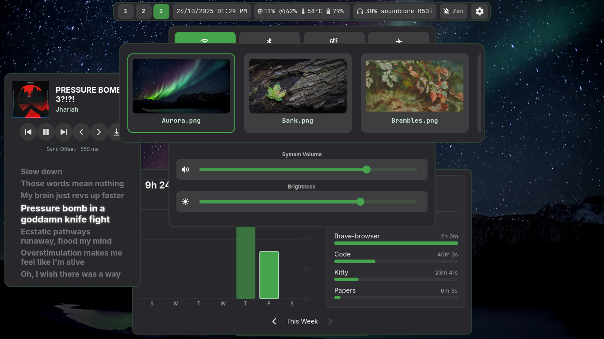

# Aurora-Shell

###### *Song: Pressure Bomb?!?! - Jhariah*
---

### An arch user's descent into AI exploitation... And apparently Desktop Shell Development.

A fully automated and cohesive desktop experience built on Hyprland, made possible using C/GTK4 - And AI exploitation.

---

### Key Features

*   **Fully Config-Driven:** Every component—from the bar to pop-up widgets—is defined in a central `config.json`. Add, remove, or reconfigure widgets without touching a line of code.
*   **Dynamic Theming:** Integrates with `wallust` to generate color palettes directly from your wallpaper. A single command updates the theme across all widgets and supported system applications.
*   **Modular Topbar:** A feature-rich bar with support for pluggable modules, including workspaces, a system tray, pop-over menus, and clickable elements.
*   **Powerful Widgets:**
    *   **Control Center:** Manage Wi-Fi, Bluetooth, audio, brightness, and system metrics.
    *   **Event-Aware Calendar:** A full calendar with support for creating, reading, and deleting events.
    *   **MPRIS Media Player:** Displays media info and perfectly **synced lyrics** for any MPRIS-compatible player.
    *   **Utility Suite:** Includes a fast App Launcher, a system Uptime badge, a hotkey Cheatsheet, and a digital-wellbeing monitor (Insight).

---

## License

Distributed under the terms of the GNU General Public License v3.0. See the 'LICENSE' file for more information.